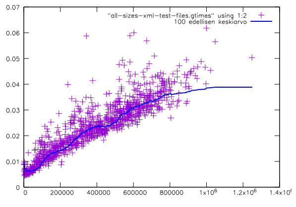

# LZ77-pakkausohjelma

## Määritys

### Lempel-Ziv 77

Ohjelma käyttää pakkausalgoritmina Lempelin ja Zivin vuonna 1977 kehittämää algoritmia, joka tunnetaan nimellä LZ77. Ohjelma toimii korvaamalla toistuvia pitkiä merkkijonoja ahneesti viittauksilla niiden aiempiin ilmentymiin.

Algoritmin toiminta on seuraavanlainen:

- Algoritmilla on parametri `k` = tutkittavan ympäristön koko
- Käydään läpi jokainen indeksi (`I`) pakattavassa merkkijonossa (`M`). Jokaiselle indeksille:
	1. Valitaan indeksiä edeltävä indeksi (`J` > `I-k`) siten, että `M[I..]`:n ja `M[J..]`:n etuliite on pisin mahdollinen
	2. Jos etuliite on suurempi kuin viittauksen pituus, tulostetaan viittaus J:hin `(J, etuliitteen pituus)`
	3. Muulloin tulostetaan merkki `M[I]`

### Pakatun tiedoston muoto

Ohjelma tulostaa pakatun tavujonon. Tavujonon ensimmäiset neljä tavua ovat pakkaamattoman merkkijonon pituus. Tämän jälkeen seuraa pakattu data, joka koostuu literaaleista merkeistä ja viittauksista.

Literaalit merkit ovat mitä tahansa muita tavuja kuin tavu 128 (0x80).

Viittaukset alkavat koodinvaihtomerkillä 128 (0x80), minkä jälkeen seuraa kahden tavun mittainen sijaintia kuvaava luku ja kahden tavun mittainen pituutta kuvaava luku. Sijaintia kuvaava luku on nykyisen sijainnin ja viitattavan sijainnin erotus.

Poiketen muista literaaleista tavu 0x80 esitetään tyhjänä viittauksena, jonka pituus on nolla (`80 00 00 00 00`).

#### Esimerkki

Pakattava merkkijono: `kissa koira kala kissa koira\n`

Pakattu tavujono:

	00000000  1d 00 00 00 6b 69 73 73  61 20 6b 6f 69 72 61 20  |....kissa koira |
	00000010  6b 61 6c 61 20 80 11 00  0b 00 0a                 |kala ......|

1. Alussa on alkuperäisen merkkijonon pituus `1d 00 00 00` eli 29.
2. Tämän jälkeen seuraa literaali `6b 69 73 73  61 20 6b 6f 69 72 61 20 6b 61 6c 61 20` eli `kissa koira kala `.
3. Lopussa on viittaus `80 11 00 0b 00`:
	1. `80` on koodinvaihtomerkki.
	2. `11 00` eli 17 kertoo, että viitataan 17 tavua aiempaan kohtaan.
	3. `0b 00` eli 11 kertoo, että viittauksen koko on 11 tavua.
	4. Viittaus viittaa siis tavujonoon `kissa koira`.
4. Lopussa on literaali `0a` eli uusi rivi.

## Toteutus

### Ohjelman rakenne

Projekti koostuu itse asiassa kahdesta ohjelmasta, pakkaajasta ja purkajasta. Kumpikin ohjelma on toteutettu C:llä, ja niistä kumpikin lukee argumenttina annetun tiedoston, ja tulostaa standardiulostuloon pakatun/puretun lopputuloksen.

Kummankin ohjelman koodi on kattavasti kommentoitu.

#### Pakkaava ohjelma

- Pakkaava ohjelma lukee tiedoston tavu kerrallaan. 
- Jokaiselle tavulle tarkistetaan, onko se esiintynyt aiemmin (tiettyyn rajaan saakka, jota kutsutaan ympäristön kooksi). Jos tavu on esiintynyt ympäristössä, tarkistetaan moniko seuraava tavu esiintyy vastaavissa kohdissa ympäristössä.
  - Jos tämä määrä on suurempi kuin 5 (viittauksen minimikoko), tulostetaan tavujen sijasta viittaus (kuten määrityksessä on määritelty).
  - Muussa tapauksessa tulostetaan tavu tai, jos tavu on koodinvaihtomerkki 0x80, tyhjä viittaus.

#### Purkava ohjelma

- Purkava ohjelma käy tiedoston läpi tavu kerrallaan ja lisää kohdatut tavut puskuriin.
- Jos tavu on koodinvaihtomerkki 0x80, luetaan viittaus.
  - Jos viittaus on tyhjä, lisätään puskuriin koodinvaihtomerkki.
  - Muuten luetaan puskurista viitatut tavut ja lisätään ne puskurin loppuun yksi kerrallaan.
- Lopuksi puskurin sisältö tulostetaan.

### Aikavaativuudet

Koska algoritmi koostuu kolmesta sisäkkäisestä silmukasta, jotka iteroivat maksimissaan _n_, _k_ ja _n_ arvoa, missä _n_ on tiedoston koko ja _k_ on tutkittavan ympäristön koko, on algoritmin aikavaativuuden yläraja O(n²k). Vastaavasti purkamisen aikavaativuuden yläraja on O(nk).

### Ohjelman kääntäminen ja suorittaminen

Ohjelman voi kääntää komennolla

	make all

Tämän jälkeen tiedoston voi pakata ja purkaa

	./compress tiedosto >tiedosto.paketti
	./decompress tiedosto.paketti >tiedosto.pakkaamaton

Ohjelmalla voi purkaa ja pakkaa minkä tahansa yhden tiedoston, joka mahtuu kokonaisena tietokoneen muistiin.

## Testaus

### Testidata

Testidatana käytettiin Semanttinen Finlex -sivulta ladattua 3921 tiedostoa, jotka sisältävät vuonna 2000 Suomessa säädetyt lait. Tiedostot ovat XML-muotoisia, ja niiden yhteenlaskettu koko on 15,4 Mt.

Koska satunnaisissa tiedostoissa ei ole rakenentta, niiden ei oleteta pakkautuvan mitenkään.

### Testien ajaminen

Testit voi ajaa komennolla

	make test

### Oikeellisuuden testaus

Algoritmin oikeellisuuden testaamiseksi varmistettiin, että tiedostot pakataan ja puretaan siten, että lopputuloksena on alkuperäinen tiedosto. Lisäksi mitattiin, kuinka tehokas pakkaus oli.

Kaikkien tiedostojen kohdalla pakkaaminen ja purkaminen tuotti alkuperäisen tiedoston.

Pakkattujen tekstitiedostojen koko oli 44 % alkuperäisestä koosta, eli pakkaus onnistui hyvin. Pakattujen satunnaisten tiedostojen koko oli 101 %, eli pakkaus oli odotusten mukaan haitallista.

| Aineisto              | Pakkaamaton koko | Pakattu koko | Pakkaussuhde |
|:----------------------|:----------------:|:------------:|:------------:|
| Lait                  | 15,4 Mt          | 6,9 Mt       | 44 %         |
| Satunnaiset tiedostot | 17,7 kt          | 17,9 kt      | 101 %        |

#### Vertailu gzip-ohjelmaan

Pakkaussuhde mitattiin myös gzip-ohjelmasta, joka on yleinen tiedostonpakkausohjelma.
Se käyttää LZ77-algoritmin lisäksi Huffman-koodausta tiivistääkseen tietoja
ja pärjääkin pelkkää LZ77-algoritmia paremmin tekstitiedostoja pakattaessa.

| Ohjelma       | Lait | Satunnaiset tiedostot |
|:-------------:|:----:|:---------------------:|
| Tämä ohjelma  | 44 % | 101 %                 |
| gzip          | 22 % | 102 %                 |

### Suorituskykytestaus

Kuten ylempänä sanotaan:

> Koska algoritmi koostuu kolmesta sisäkkäisestä silmukasta, jotka iteroivat maksimissaan _n_, _k_ ja _n_ arvoa, missä _n_ on tiedoston koko ja _k_ on tutkittavan ympäristön koko, on algoritmin aikavaativuuden yläraja O(n²k). Vastaavasti purkamisen aikavaativuuden yläraja on O(nk).

Suorituskyvyn testaamiseksi mitattiin suoritusaika jokaisen XML-tiedoston pakkaamiselle ja purkamiselle yhteensä. Tulokset on esitetty alla olevassa kuvassa. Kuvan pystyakselilla on suoritusaika sekunneissa ja vaaka-akselilla tiedoston koko tavuissa. Kuvassa on myös pisteisiin sovitettu suora.

Kuten kuva osoittaa, suoritusaika näyttäisi olevan lineaarinen tiedoston koon suhteen, kun _n_ < 0,2 Mt. Tekstitiedosto-tyyppiselle datalle suoritusaika on siis hyvä.

#### Vertailu gzip-ohjelmaan

Alla on esitetty gzip-ohjelman pakkaamiseen ja purkamiseen käyttämä aika kunkin tekstitiedoston kohdalla samalla tavalla kuin aiemmassa kuvassa. Ohjelma pärjää erinomaisesti. Sen käyttämä minimiaika ja keskimääräinen aika näyttävät nousevan lineaarisesti suhteessa tiedoston kokoon, mutta koska isompia tiedostoja on vähän, tätä on vaikea sanoa tarkasti. Suurin osa isompien tiedostojen suoritusajoista osuu samalle vaihteluvälille kuin pienten tiedostojen suoritusajat (n. 0,005–0,015). Yksittäisillä tiedostoilla on kulunut vaihteluväliä huomattavasti suurempi aika, jopa n. 0,028, mutta otos ei ole kovin suuri.

